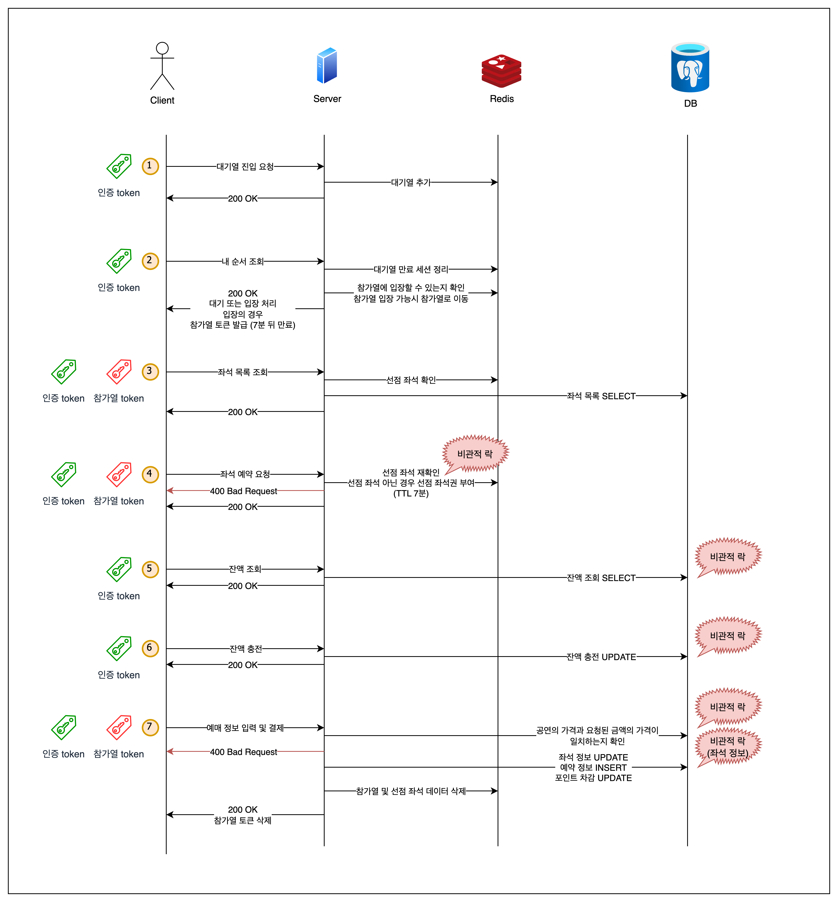
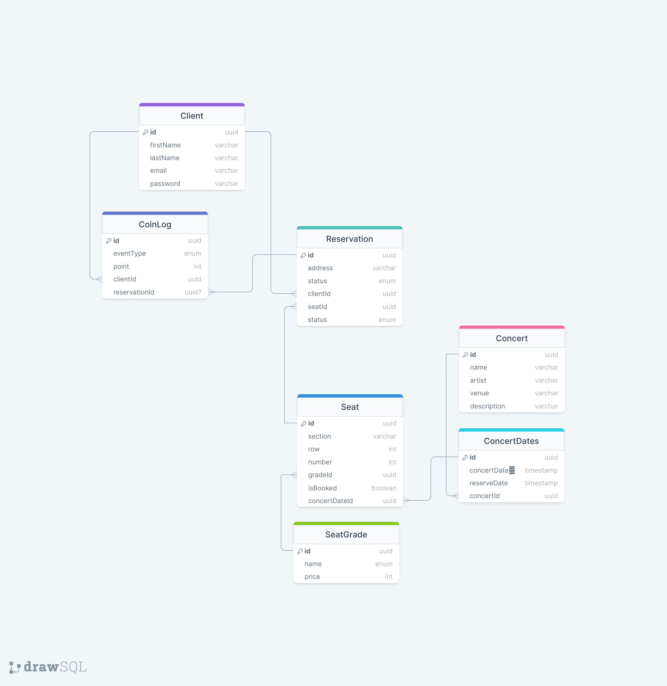

## - 시나리오
- 콘서트 예약 서비스
---
## - 개발환경
- 아키텍쳐
    - Clean + Layered Architecture
- 백엔드
    - NestJS
- DB
    - PostgreSQL
    - TypeORM
- Test
    - Jest
---
## - 시나리오 분석
1. Browser 마다 고유한 Session-Id를 가지고 ‘예매하기” 클릭 시 Booking-session-Id 헤더에 담아서 전달한다 (API - 1)
    1. 해당 방법은 브라우저를 나간 뒤 들어오면 다시 맨 뒤에서 대기하게 되는 구조 (새로고침하면 망함)
2. 대기열 Redis SortedSet 자료구조에 넣는다
    1. session-id, initial-time,  last-active-time 의 데이터를 가집니다
3. 내 순서 조회 (Polling) (API - 2)
    1. 내 순서 조회 전, 대기열에서 기록된 데이터 중 last-active-time 이 너무 오래된 데이터는 삭제 후 순서를 조회한다 (이탈자를 처리하기 위한 방식)
    2. 이탈자가 아니라면 지속적인 polling을 시도했을 것이며 polling을 시도하는 경우 본인의 대기열 데이터의 last-active-time도 업데이트 되기 때문에 위와 같은 방식으로 이탈자 정리가 가능하다고 판단
4. 참가열에 입장이 불가능하다면 그대로 대기열에 대기하며 나의 대기열 데이터에서 last-active-time을 update
5. 참가열에 입장이 가능하다면 대기열에서 삭제되며 참가열 입장
    1. 참가열도 대기열과 동일한 구조를 가지며 10명으로 제한된다 (TTL 7분)
6. 참가열에 입장하면 참가열 토큰이 발급된다
    1. 토큰의 만료시간은 7분이며 모든 예매과정을 7분 안으로 마무리 해야함
7. 좌석 목록 조회 (API - 3)
    1. 예매가능 좌석을 조회
    2. DB  및 Redis에 존재하는 선점 좌석까지 고려합니다
8. 좌석 예약 요청 (API - 4)
    1. ‘좌석선택’ 클릭 후 과정
    2. Redis를 통해서 다른 사람이 먼저 선점을 하지 않는지 재확인
    3. 없다면 해당 session에게 좌석선점권 부여 (TTL 7분)
    
    <aside>
    💡 8-b, 8-c 의 과정은 Redis 자체에 비관적 락이 필요합니다
    
    </aside>
    
9. 예매 정보 입력 및 결제 (API - 5)
    1. 충전 된 포인트가 부족한지 확인합니다
    2. 포인트가 충분하다면 차감 log 데이터를 남기고 좌석 예매 데이터를 만듭니다
    3. 참가열 & 좌석 선점 데이터에서 삭제
    4. 참가열 토큰 삭제
    5. 만일의 사태를 위해서 해당 seat에 배정되는 유저는 단 1명으로 제한되도록 합니다 (해당 seat 행 update시 비관적 락 또는 reservation 데이터 생성시 seat 데이터와 오직 1:1로 연결되도록)

💡 잔여 API 목록
1. 회원가입
2. 로그인
3. 로그아웃
4. 잔액충전
5. 잔액조회
6. 취소요청
<aside>
💡 API 3, 4, 5 번은 요청시 참가열 토큰이 필요합니다
</aside>

---
## - 동시성 제어
1. Redis를 통한 좌석선점 (분산락)
   1. 좌석선점 요청이 들어오면 Redis에 해당 좌석에 대한 선점 여부를 확인합니다
   2. key를 콘서트ID, Section, Row, Seat로 구성하여 해당 key에 대한 선점 여부를 확인합니다
   3. ttl을 7분으로 설정하여 7분이 지나면 해당 선점 데이터는 삭제됩니다
   4. 사용자는 좌석정보를 받는 경우 seat 테이블의 isBooked 속성이 false인 경우와 Redis에 해당 좌석에 대한 선점 여부가 없는 경우에만 좌석선점을 할 수 있습니다
2. DB를 통한 포인트 충전 및 차감 (비관적 락) 
   1. 포인트 충전 및 차감 요청이 들어오면 해당 유저의 포인트를 업데이트 합니다
   2. 포인트 업데이트 전에 해당 유저의 포인트를 비관적 락을 걸어 다른 요청이 동시에 포인트를 업데이트 할 수 없도록 합니다

---
## - DB Index
1. Seat 테이블에서 인덱스 활용
   1. isBooked 속성에 대한 인덱스를 생성하여 좌석 예약 여부에 대한 조회를 빠르게 할 수 있도록 합니다
   2. concertDatedId 속성에 대한 인덱스를 생성하여 콘서트 날짜별로 좌석을 조회할 수 있도록 합니다
---
## - Flow Chart

---
## - API 명세 및 Mock API
### 1번 yaml 파일을 2번 링크에서 사용합니다
1. https://raw.githubusercontent.com/jsjsjskjs/hhplus-server/main/swagger.yaml
2. https://editor.swagger.io/

## - DB Schema

---
